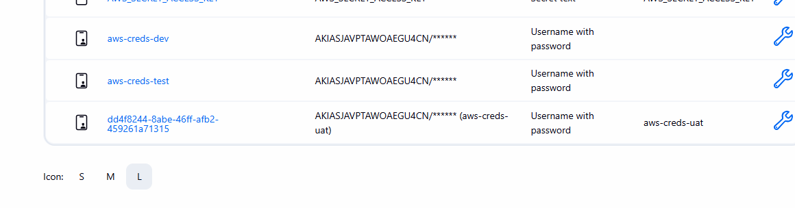

terraform/
├── main.tf           # Calls the lambda module
├── variables.tf      # Declares 'environment'
├── dev.tfvars        # env = "dev"
├── test.tfvars       # env = "test"
├── uat.tfvars        # env = "uat"
└── module/
    └── lambda/
        ├── main.tf       # IAM + Lambda creation here 
        └── variables.tf  # policy lists + environment variable  

####################  install tf on ubuntu #############

    1  terraform -version
    2  sudo apt-get update -y
    3  sudo apt-get install -y gnupg software-properties-common
    4  curl -fsSL https://apt.releases.hashicorp.com/gpg | sudo gpg --dearmor -o /usr/share/keyrings/hashicorp-archive-keyring.gpg
    5  echo "deb [signed-by=/usr/share/keyrings/hashicorp-archive-keyring.gpg] \
https://apt.releases.hashicorp.com $(lsb_release -cs) main" | sudo tee /etc/apt/sources.list.d/hashicorp.list
    6  sudo apt-get update -y
    7  sudo apt-get install -y terraform
    8  terraform -version

#############  install  aws cli on jenkins  to auth #########
    1  sudo apt-get update -y
    2  sudo apt-get install -y awscli
    3  sudo apt-get update -y
    4  sudo apt-get install -y awscli
    5  sudo apt-get install -y unzip
    6  curl "https://awscli.amazonaws.com/awscli-exe-linux-x86_64.zip" -o "awscliv2.zip"
    7  unzip awscliv2.zip
    8  sudo ./aws/install
    9  aws --version
   10  history

set creds >>>>> u name + pswd and in ID cet as aws-cdres-dev(same as j-file)

